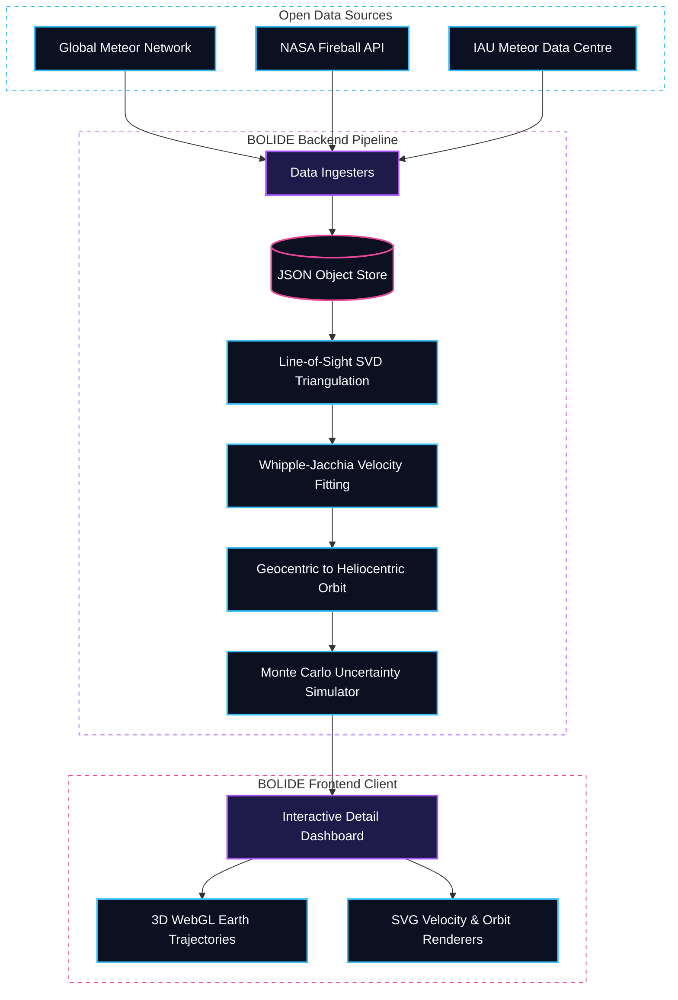

    
  <h1>B O L I D E</h1>
  
<strong>Multi-Station Meteor Trajectory Reconstruction Platform</strong>

  
<i>Unlocking the night sky for citizen scientists and planetary researchers alike.</i>

  
  
  
  

## ☄️ The Problem Space

Every night, dedicated citizen-science networks like the Global Meteor Network (GMN) and NASA's All-Sky Fireball Network capture thousands of meteors passing through Earth's atmosphere simultaneously from hundreds of vantage points.

> **The Barrier:** This scientifically rich, open-source observation data is traditionally locked inside CSV files and complex planetary science formats that almost nobody outside a small circle of planetary scientists knows how to use. 

Triangulating these multi-station observations requires solving a highly complex spatial geometry problem—navigating through four different celestial/terrestrial coordinate systems, correcting atmospheric refraction, dynamically fitting deceleration models against the atmosphere, and identifying inter-station clock drift. 

**Our Solution:** **BOLIDE** bridges the gap. It is an end-to-end full-stack web application that fetches authentic meteor observation data and runs a pristine, custom-built, transparent computation pipeline to reconstruct the 3D trajectory. We present the findings in an aesthetically engaging, highly interactive interface designed so that anyone can explore, compare, and understand meteor events—without requiring prior scientific knowledge.

---

## 🏗️ Technical Architecture & Workflow

BOLIDE operates on a strict decoupling of Data Ingestion, Physics Computation, and Visual Rendering.

---

## 🖥️ Overview of Application Sections

BOLIDE features a comprehensive suite of tools designed to cater to both planetary-science researchers and the general public interchangeably.

### 1. The Explore Dashboard (`/`)
Serves as the mission control for querying the unified observation catalog.
- **Event Catalogue:** Browse 300+ authentic NASA and GMN fireball events, filtering dynamically by network, date, or associated meteor shower.
- **Thumbnail Micro-visualizations:** Every event card natively renders an SVG line-art thumbnail summarizing the observed trajectory and station layout automatically.
- **Live Feed System:** A side-panel that actively interfaces with the American Meteor Society (AMS) JSON API to present a continuous, real-time ticker of newly reported terrestrial fireball events.

### 2. Trajectory Reconstruction Viewer (`/event/[id]`)
The core investigative interface for deep-diving into the physics of a single meteor event.
- **Interactive 3D Earth (`Three.js`)**: A manipulatable WebGL globe demonstrating the precise atmospheric geometry. Computes and draws geocentric Earth-crossing lines-of-sight from all recording stations toward the computed trajectory.
- **Velocity Deceleration Modeling**: A bespoke SVG charting tool tracking the meteoroid's slowdown. Plots real data residuals against a dynamic **Whipple-Jacchia exponential atmospheric drag fit**.
- **Sky Radiant & Orbit Panels**: Real-time celestial plots that project the origin of the meteor (RA/Dec) in the sky alongside computationally extracted Keplerian Orbital Elements (translating the object back to the asteroid belt or cometary cloud).
- **Plain-English Quality Translation**: A generated, dynamic text summary interprets the complex triangulation variables—Convergence Angle ($Q$), Arcsecond Residuals, and Timing Offsets—into a simple 0-100 Scientific Credibility score.

### 3. Multi-Event Comparison Tool (`/compare`)
A comparative analytics dashboard for clustering events. 
- **Sky Map Overlay:** Maps 2 to 5 concurrent radiants (with $1\sigma$ uncertainty ellipses) onto a single celestial sphere, dynamically cross-referencing intersections to confirm or deny joint meteor shower membership.
- **Velocity Overlay Networks:** Plots normalized deceleration curves against one another to empirically distinguish slow entry objects vs fast entry (retrograde) bodies.

### 4. The Physics Engine Reference (`/physics`)
A completely transparent, interactive mathematics notebook detailing the equations that power BOLIDE.
- Contains interactive SVD modeling visualizations.
- Traces the exact steps required to transform Geodetic Station Coordinates $\to$ Earth-Centric Fixed Vectors $\to$ Julian-dated Inertial Reference Frames.

---

## 🔬 The Scientific Pipeline Architecture

We **did not** delegate the core math to black-box libraries. The entire pipeline is hand-built in `NumPy` and `SciPy`.
1. **Coordinate Transforms**: Raw RA/Dec celestial angles are translated into Earth-Centred Earth-Fixed (ECEF) Cartesian vectors, corrected into the inertial J2000 frame, and ultimately resolved into Heliocentric Ecliptic space.
2. **Robust Triangulation**: The Line-of-Sight (LoS) intersections are solved via Singular Value Decomposition overdetermined matrices, equipped with dynamic RANSAC outlier rejection to discard cosmic ray anomalies.
3. **Non-linear Dynamics**: Atmospheric density exponentially causes non-linear deceleration. We use `scipy.optimize` to fit the physics of the Whipple-Jacchia exponential drag model to extract true entry velocity ($v_\infty$).
4. **Timing Offsets**: Clock anomalies (5-50ms difference between stations) are treated as free parameters computed natively during the velocity integration.
5. **Monte Carlo Integrity**: 100+ simulated perturbations injecting astrometric noise are processed to emit statistically robust $1\sigma$ confidence intervals and orbital uncertainty ellipses.

---

<i>Bridging the gap between the sky and the screen.</i>

